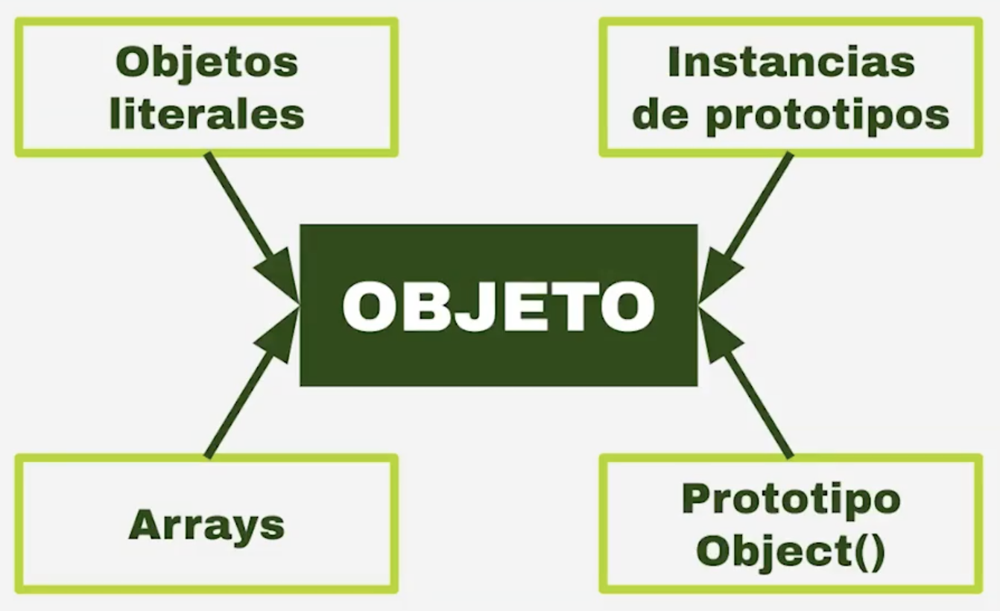

Antes de hablar de la Programación Orientada a Objetos debemos saber que en la programación existen muchos paradigmas qué nos permiten resolver problemas desde diferentes enfoques.

# 1. ¿Qué es un Paradigma?

Un paradigma es un camino, estandares, maneras de resolver un problema, y ese mismo problema se puede resolver desde muchos caminos, estandares o maneras; es decir, desde muchos paradigmas. 

## ¿Para qué nace cada Paradigma?

Cada Paradigma nace para dar solución a ciertos problemas generados por Paradigmas anteriores. 

No existe un Paradigma mejor que otro, Si existe un Paradigma más útil que otro de acuerdo a la situación que se quiere resolver.

## ¿Cuales son los Paradigmas más usados?

Los tres paradigmas más populares son:
1. El paradigma Estructurado
2. El paradigma Orientado a Objetos
3. El paradigma Funcional

# 1.1 ¿Qué es el Paradigma de Programación Orientada a Objetos?

 Es una forma de abordar los problemas abstrayendo los elementos en forma de objetos.

 **Conceptos:**
- **Clase:** Representación de métodos y atributos que representan a una entidad.
- **Objeto:** Instancia de una clase.
- **Herencia:** Crear nuevas clases con características similares a partir de otras.
- **Encapsulamiento:** Esconder datos que solo pueden ser accedidos por la clase.
- **Polimorfismo:** Un objeto puede comportarse de muchas formas, ejemplo: En herencia, las clases hijas pueden comportarse como su clase padre y viceversa.

## ¿Qué problemas busca solucionar el Paradgima de la POO?

El Paradgima de la POO busca resolver los siguientes problemas:
1. Orden: Entidades, Objetos y sus relaciones
2. Código reutilizable: Clases = Molde, Instancias de Objetos = Copias personalizales de las Clases

# 1.2 Objetos, Clases y Prototipos

## ¿Qué es un Objeto en javaScript?
JavaScrit no esta basado en Clases, si no, en Prototipos.

Los Objetos literales son diferentes a las Instancias de Clases.

- Un Objeto literal lo creamos de la nada cuando lo escribimos a mano y luce así:
  ```js
  const lista_de_nombre = {
    "Jorge": 15,
    "Juan": 50,
    "Julio": 5,
    "Jose": 75,
    "Jairo": 25,
    "Jesus": 55,
  }
  ```
- Una Instancia la creamos a partir de una Clase ya existente y luce así:
  ```js
  function Student(){
    this.name = "Jorge",
    this.age = 31,
    this.points = 740
  }

  const juanita = new Student();
  ```
  No estamos creando una Clase, sino, que estamos creando una Función(Prototipo) y lo interesante de esta función son dos cosas:
  1. Estamos usando la palabra reservada **`this`** para guardar los atributos.
  2. Cuando llamamos nuestra función para crear la "Instancia de la clase", lo hacemos usando la palabra reservada **`new`** 

En JavaScript todo es un Objeto




### ¿Qué es “this” (este)?

Es posible que hayas notado algo un poco extraño en nuestros métodos. Mira esto, por ejemplo:
```js
saludo: function() {
  alert('¡Hola!, Soy '+ this.nombre.pila + '.');
}
```
 La palabra clave this se refiere al objeto actual en el que se está escribiendo el código, por lo que en este caso this es equivalente a la persona. Entonces, ¿por qué no escribir persona en su lugar? Como verás en el artículo JavaScript orientado a objetos para principiantes cuando comenzaremos a crear constructores, etc., this es muy útil: siempre asegurará que se usen los valores correctos cuando cambie el contexto de un miembro (por ejemplo, dos diferentes instancias de objetos persona) pueden tener diferentes nombres, pero querráx usar su propio nombre al decir su saludo).
Vamos a ilustrar lo que queremos decir con un par de objetos persona simplificados:

```js
var persona1 = {
  nombre: 'Chris',
  saludo: function() {
    alert('¡Hola!, Soy '+ this.nombre + '.');
  }
}

var persona2 = {
  nombre: 'Brian',
  saludo: function() {
    alert('¡Hola!, Soy '+ this.nombre + '.');
  }
}
```

